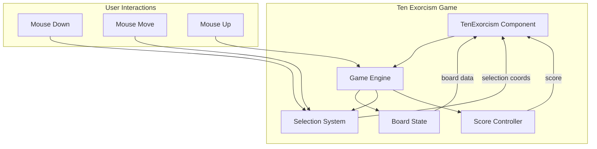
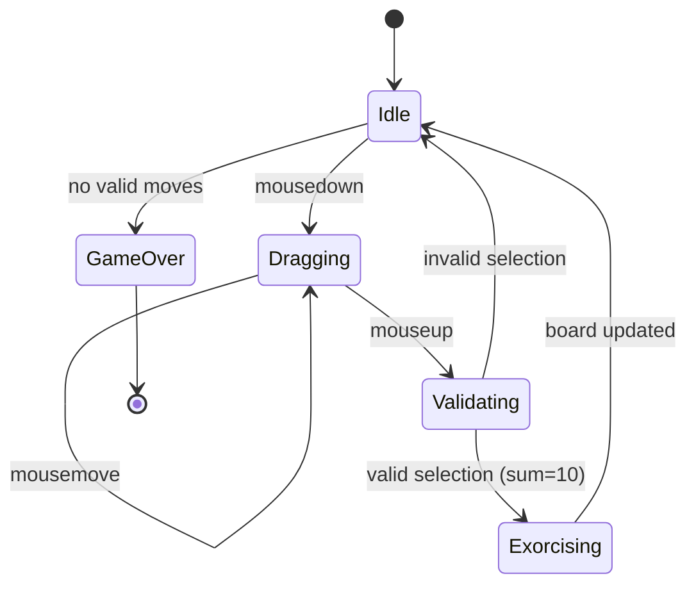
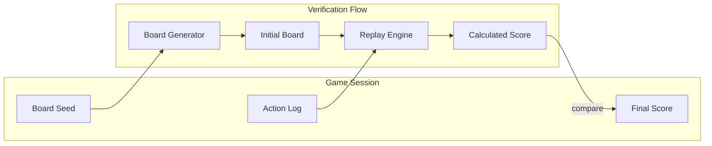

# Design Document: Ten Exorcism Game

## Overview

Ten Exorcism is a rectangle-based puzzle game implemented as a React component within the 1k2p mini game hub. Players exorcise ghosts by selecting rectangular areas on a 10×17 grid where the sum of ghost power values equals exactly 10. The game uses a pure React implementation with TypeScript, leveraging mouse events for rectangle selection and CSS Grid for board layout.

## Architecture



The architecture follows a component-based design with clear separation of concerns:

1. **TenExorcism Component**: Main React component handling UI rendering and user interactions
2. **Game Engine**: Core logic for game state management, validation, and scoring
3. **Board State**: Manages the 10×17 grid of ghost tiles and empty cells
4. **Selection System**: Handles mouse-based rectangle selection
5. **Score Controller**: Tracks and updates player score

## Components and Interfaces

### Core Types

```typescript
// Cell state representing either a ghost or empty cell
type CellState = {
  power: number | null  // 1-9 for ghost, null for empty
}

// Board represented as 2D array [row][col]
type Board = CellState[][]

// Rectangle selection coordinates
type Selection = {
  startRow: number
  startCol: number
  endRow: number
  endCol: number
} | null

// Game state
type GameState = {
  board: Board
  score: number
  selection: Selection
  isGameOver: boolean
  isDragging: boolean
}

// Selection validation result
type ValidationResult = {
  isValid: boolean
  sum: number
  tileCount: number
}
```

### Component Structure

```
src/games/ten-exorcism/
├── game.ts           # GameMeta for hub registration
├── index.tsx         # Main TenExorcism component
├── types.ts          # TypeScript type definitions
├── gameEngine.ts     # Core game logic functions
├── sessionManager.ts # Game session and action logging
├── seededRandom.ts   # Deterministic PRNG implementation
├── useGameState.ts   # Custom hook for game state management
└── styles.css        # Scoped CSS styles
```

### Key Functions

```typescript
// Board initialization
function createInitialBoard(): Board

// Selection validation
function validateSelection(board: Board, selection: Selection): ValidationResult

// Execute exorcism
function executeExorcism(board: Board, selection: Selection): Board

// Check for game over
function hasValidMoves(board: Board): boolean

// Calculate rectangle bounds from drag coordinates
function calculateSelectionBounds(
  startRow: number, startCol: number,
  endRow: number, endCol: number
): Selection
```

## Data Models

### Board Representation

The game board is a 10×17 grid (10 columns × 17 rows) stored as a 2D array:

```typescript
// Board dimensions
const BOARD_COLS = 10
const BOARD_ROWS = 17

// Initial board generation
function createInitialBoard(): Board {
  const board: Board = []
  for (let row = 0; row < BOARD_ROWS; row++) {
    const rowData: CellState[] = []
    for (let col = 0; col < BOARD_COLS; col++) {
      rowData.push({
        power: Math.floor(Math.random() * 9) + 1  // 1-9
      })
    }
    board.push(rowData)
  }
  return board
}
```

### Selection State Machine



### Score Calculation

Score increments by the number of tiles exorcised in each valid selection:
- Single tile with power 10: Not possible (max power is 9)
- Multiple tiles summing to 10: Score += tile count

## Score Verification System

### Overview

To prevent score manipulation in client-side games, the system implements a deterministic replay architecture. All game state can be reproduced from a seed and action log, enabling server-side verification.

### Architecture



### Deterministic Random Number Generator

Using a seeded PRNG (Mulberry32) ensures identical boards for the same seed:

```typescript
// Seeded PRNG - Mulberry32 algorithm
function createSeededRandom(seed: number): () => number {
  return function() {
    let t = seed += 0x6D2B79F5
    t = Math.imul(t ^ t >>> 15, t | 1)
    t ^= t + Math.imul(t ^ t >>> 7, t | 61)
    return ((t ^ t >>> 14) >>> 0) / 4294967296
  }
}

// Deterministic board generation
function createBoardFromSeed(seed: number): Board {
  const random = createSeededRandom(seed)
  const board: Board = []
  for (let row = 0; row < BOARD_ROWS; row++) {
    const rowData: CellState[] = []
    for (let col = 0; col < BOARD_COLS; col++) {
      rowData.push({
        power: Math.floor(random() * 9) + 1
      })
    }
    board.push(rowData)
  }
  return board
}
```

### Action Log Types

```typescript
// Individual game action
type GameAction = {
  type: 'SELECT'
  selection: {
    startRow: number
    startCol: number
    endRow: number
    endCol: number
  }
  timestamp: number  // ms since game start
  result: 'valid' | 'invalid'
  scoreGained: number
}

// Complete game session for verification
type GameSession = {
  sessionId: string
  boardSeed: number
  startTime: number
  actions: GameAction[]
  finalScore: number
  endTime: number
  isComplete: boolean
}
```

### Replay Engine

```typescript
// Replay a game session to verify score
function replaySession(session: GameSession): number {
  const board = createBoardFromSeed(session.boardSeed)
  let score = 0
  
  for (const action of session.actions) {
    if (action.type === 'SELECT') {
      const validation = validateSelection(board, action.selection)
      if (validation.isValid) {
        executeExorcism(board, action.selection)
        score += validation.tileCount
      }
    }
  }
  
  return score
}

// Verify session integrity
function verifySession(session: GameSession): boolean {
  const calculatedScore = replaySession(session)
  return calculatedScore === session.finalScore
}
```

### Session Export Format

For future backend integration, sessions are exported as JSON:

```typescript
function exportSession(session: GameSession): string {
  return JSON.stringify({
    v: 1,  // format version
    id: session.sessionId,
    seed: session.boardSeed,
    start: session.startTime,
    end: session.endTime,
    actions: session.actions.map(a => ({
      t: a.timestamp,
      s: [a.selection.startRow, a.selection.startCol, 
          a.selection.endRow, a.selection.endCol],
      r: a.result === 'valid' ? 1 : 0,
      p: a.scoreGained
    })),
    score: session.finalScore
  })
}
```

## Correctness Properties

*A property is a characteristic or behavior that should hold true across all valid executions of a system—essentially, a formal statement about what the system should do. Properties serve as the bridge between human-readable specifications and machine-verifiable correctness guarantees.*

Based on the prework analysis, the following correctness properties have been identified:

### Property 1: Board Dimensions Invariant

*For any* generated board, the board SHALL have exactly 17 rows and 10 columns.

**Validates: Requirements 1.1**

### Property 2: Initial Power Values Range

*For any* cell in a newly generated board, the power value SHALL be an integer between 1 and 9 inclusive.

**Validates: Requirements 1.2**

### Property 3: Rectangle Selection Bounds

*For any* two points (startRow, startCol) and (endRow, endCol) on the board, the calculated selection SHALL form a valid rectangle with normalized bounds (minRow ≤ maxRow, minCol ≤ maxCol).

**Validates: Requirements 2.1, 2.2**

### Property 4: Power Sum Calculation Correctness

*For any* board and valid selection, the calculated sum SHALL equal the sum of all non-null power values within the selected rectangle.

**Validates: Requirements 3.1**

### Property 5: Validation Correctness

*For any* selection, the validation result isValid SHALL be true if and only if the power sum equals exactly 10.

**Validates: Requirements 3.2, 3.3, 3.4**

### Property 6: Exorcism Clears Selected Cells

*For any* valid exorcism (sum = 10), all cells within the selected rectangle SHALL have their power set to null after execution.

**Validates: Requirements 4.1, 4.2**

### Property 7: Score Increment Correctness

*For any* valid exorcism, the score SHALL increase by exactly the count of non-null cells in the selection before exorcism.

**Validates: Requirements 4.3, 6.2**

### Property 8: Invalid Selection Preserves Board

*For any* invalid selection (sum ≠ 10), the board SHALL remain unchanged after the operation.

**Validates: Requirements 4.4**

### Property 9: Non-Selected Cells Preservation

*For any* exorcism operation, all cells outside the selected rectangle SHALL retain their original power values.

**Validates: Requirements 5.1, 5.4**

### Property 10: No New Ghosts Property

*For any* exorcism operation, no cell that was empty (power = null) before the operation SHALL become non-empty after.

**Validates: Requirements 5.2, 5.3**

### Property 11: Valid Moves Detection

*For any* board, hasValidMoves SHALL return true if and only if there exists at least one rectangle where the sum of power values equals 10.

**Validates: Requirements 7.1, 7.2**

### Property 12: Deterministic Board Generation

*For any* seed value, calling createBoardFromSeed with the same seed SHALL produce identical boards.

**Validates: Requirements 9.1, 9.2**

### Property 13: Session Replay Consistency

*For any* completed GameSession, replaying the action log on the seeded board SHALL produce the same final score.

**Validates: Requirements 11.4, 11.5**

### Property 14: Action Log Completeness

*For any* game session, the action log SHALL contain all selection attempts made during the game in chronological order.

**Validates: Requirements 10.1, 10.2, 10.3**

## Error Handling

### User Input Errors

| Error Condition | Handling Strategy |
|----------------|-------------------|
| Selection outside board bounds | Clamp coordinates to valid board range |
| Empty selection (no drag) | Ignore and reset selection state |
| Selection on empty cells only | Allow but mark as invalid (sum < 10) |

### State Errors

| Error Condition | Handling Strategy |
|----------------|-------------------|
| Invalid board state | Reset to initial board |
| Negative score | Prevent by only allowing increments |
| Game over with valid moves | Re-check hasValidMoves |

### Visual Feedback

- Invalid selection: Red highlight with shake animation
- Valid selection: Green highlight with pulse animation
- Successful exorcism: Ghost fade-out animation
- Game over: Modal overlay with final score

## Testing Strategy

### Dual Testing Approach

The testing strategy employs both unit tests and property-based tests:

1. **Unit Tests**: Verify specific examples, edge cases, and error conditions
2. **Property Tests**: Verify universal properties across all valid inputs using randomized testing

### Property-Based Testing Configuration

- **Library**: fast-check (TypeScript property-based testing library)
- **Minimum iterations**: 100 per property test
- **Tag format**: `Feature: ten-exorcism-game, Property {number}: {property_text}`

### Test Categories

#### Unit Tests
- Board initialization with correct dimensions
- Single-cell selection validation
- Edge case: selection at board boundaries
- Edge case: selection spanning entire board
- Score initialization to zero
- Game over detection with empty board

#### Property Tests
- Property 1: Board dimensions invariant
- Property 2: Initial power values range
- Property 3: Rectangle selection bounds
- Property 4: Power sum calculation correctness
- Property 5: Validation correctness
- Property 6: Exorcism clears selected cells
- Property 7: Score increment correctness
- Property 8: Invalid selection preserves board
- Property 9: Non-selected cells preservation
- Property 10: No new ghosts property
- Property 11: Valid moves detection
- Property 12: Deterministic board generation
- Property 13: Session replay consistency
- Property 14: Action log completeness

### Test File Structure

```
src/games/ten-exorcism/
├── __tests__/
│   ├── gameEngine.test.ts      # Unit tests for game logic
│   └── gameEngine.property.ts  # Property-based tests
```
