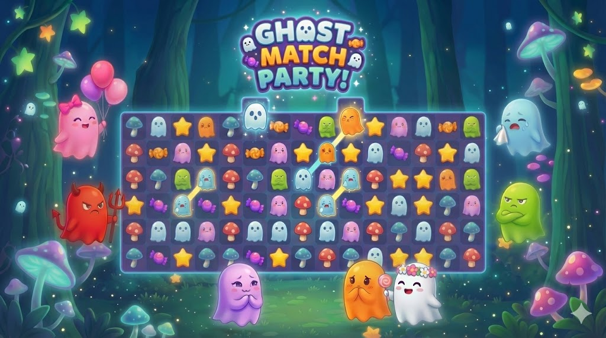

# Emotion Match - 3-Match Puzzle Game

A React-based 3-match puzzle game where players match emotion blocks to reach high altitudes within a time limit.

## Game Features

### Core Gameplay
- **3-Match Mechanics**: Match 3 or more adjacent blocks horizontally or vertically
- **Drag & Swap System**: Drag blocks to swap with adjacent blocks (limited to 2-block selection)
- **Gravity & Cascading**: Blocks fall down when matches are cleared, creating automatic combo chains
- **Time Limit**: 60-second countdown (hardcore mode - no time bonus)
- **Visual Effects**: Stunning neon pop animations with color-changing effects

### Game Modes
- **Normal Mode**: 10x10 grid with 6 selected emotion characters
- **Hard Mode**: 12x12 grid with 8 selected emotion characters

### Scoring System
- 3 blocks = 3km altitude
- 4 blocks = 5km altitude  
- 5 blocks = 7km altitude
- 6+ blocks = 10km altitude
- Combos are calculated separately and added together

### Special Features
- **Character Selection**: Choose your emotion characters before starting
- **Hint System**: 2 hints per game that highlight possible moves with golden glow
- **Pause/Resume**: Pause the game anytime during play
- **No Valid Moves Detection**: Game ends if no moves are available
- **Drag Selection Overlay**: Visual feedback showing selected block area with neon borders
- **Cascade Matching**: Automatic chain reactions when blocks fall and create new matches

## Game Flow

1. **Main Menu**: Beautiful themed interface with animated buttons
2. **How to Play**: Interactive modal explaining game rules and hardcore mode
3. **Difficulty Selection**: Choose between Normal (10x10) or Hard (12x12) mode
4. **Character Selection**: Pick 6 or 8 emotion characters from 10 available options
5. **Gameplay**: Match blocks within the time limit to maximize altitude with stunning visual effects
6. **Game Over**: Elegant popup showing final score with "MAIN" button to return

## Available Emotion Characters

- Black Frightened
- Blue Sad
- Green Disgust
- Grey Love
- Orange Shy
- Pink Happy
- Purple Envy
- Red Angry
- White Smile
- Yellow Frightened

## Technical Implementation

### Performance Optimizations
- React.memo for preventing unnecessary re-renders
- Separated timer component to avoid full board re-renders
- CSS transitions for smooth animations
- Optimized match detection algorithm

### State Management
- useReducer for complex game state management
- Minimal re-renders through careful state structure
- Efficient board update patterns

### Animations & Visual Effects
- **Neon Pop Animations**: Blocks explode with purple→pink→blue→teal color transitions
- **GPU-Accelerated Rendering**: Smooth 60fps animations using CSS transforms and opacity
- **Drag Selection Overlay**: Real-time visual feedback with golden neon borders
- **Falling Block Physics**: Natural gravity simulation with eased transitions
- **Hint Highlighting**: Pulsing golden glow effects for suggested moves
- **16:9 Aspect Ratio**: Consistent layout across all screen sizes with letterboxing

## Controls

- **Drag & Drop**: Drag blocks to swap with adjacent blocks (maximum 2-block selection)
- **Hint Button**: Reveal a possible move with golden highlighting (2 uses per game)
- **Pause Button**: Pause/resume game (positioned next to timer)
- **Touch Support**: Full mobile compatibility with touch gestures

## Game End Conditions

1. **Time Runs Out**: 60-second timer reaches zero (hardcore mode)
2. **No Valid Moves**: No possible swaps can create matches
3. **Player Gives Up**: Manual game termination from pause menu

## Visual Design

- **Night Sky Theme**: Beautiful space-themed backgrounds for each game screen
- **Cute Character Design**: 10 unique emotion ghost characters with distinct personalities
- **Glassmorphism UI**: Modern frosted glass effects with backdrop blur
- **Neon Aesthetics**: Cyberpunk-inspired glowing borders and effects
- **Responsive Layout**: Optimized for desktop and mobile devices

The game emphasizes strategic thinking, pattern recognition, and quick decision-making under time pressure, all wrapped in a visually stunning package with smooth animations and delightful sound effects.